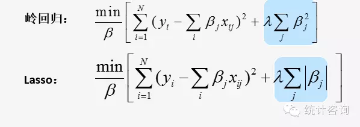
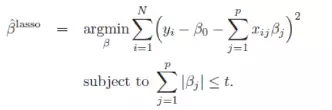
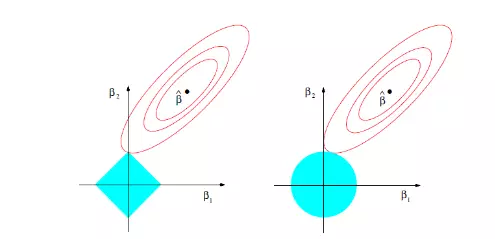
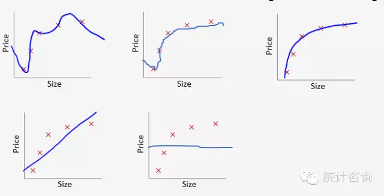
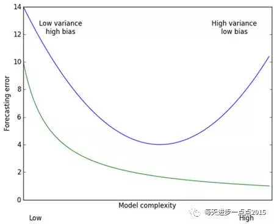

### 变量筛选

在高维数据领域里，变量筛选占据至关重要的地位，有效的变量筛选方法可以从大量的预测变量中剔除多余的变量，挑选出最优子集，从而得到尽可能简洁的模型来提高模型的解释性和预测精度。

### 模型拟合

当我们进行模型拟合的时候，我们需要衡量一个过度拟合和拟合不足的问题。为了防止过度拟合的一个有效的方法就是对模型的复杂度进行控制。模型的自变量个数越多说明复杂度越高。 

约束自变量个数的方法:

1. 子集选择：通过逐步回归和最优子集法，对可能的子集进行拟合模型，利用判别准则(如AIC、BIC、Cp、调整R^2^)决定最优模型。问题在于：高维数据计算量大，不稳定。
2. 维数约减：主成分回归，把p个变量投影到m维空间(m<p)，利用投影得到的不相关组合建立线性模型。问题在于：不能进行变量选择。
3. 正则化(基于惩罚)：Ridge回归和LASSO回归，通过对最小二乘估计加入罚约束，使某些系数进行压缩，甚至压缩为0，从而实现避免过拟合和变量选择。

### LASSO regression
Tibshirani(1996) 提出了Lasso(The Least Absolute Shrinkage and Selectionator Operator)算法。这种算法通过构造一个惩罚函数获得一个精炼的模型；通过最终确定一些指标的系数为零，LASSO算法实现了指标集合精简的目的。这是一种处理具有复共线性数据的有偏估计。Lasso的基本思想是在回归系数的绝对值之和小于一个常数的约束条件下，使残差平方和最小化，从而能够产生某些严格等于0的回归系数，得到解释力较强的模型。

LASSO回归的特点是在拟合`广义线性模型`的同时进行变量筛选(Variable Selection)和复杂度调整(Regularization)。 因此，不论目标因变量(dependent/response varaible)是连续的(continuous)，还是二元或者多元离散的(discrete)， 都可以用LASSO回归建模然后预测。 这里的`变量筛选`是指不把所有的变量都放入模型中进行拟合，而是有选择的把变量放入模型从而得到更好的性能参数。 `复杂度调整`是指通过一系列参数控制模型的复杂度，从而避免Overfitting。 **对于线性模型来说，复杂度与模型的变量数有直接关系，变量数越多，模型复杂度就越高。 更多的变量在拟合时往往可以给出一个看似更好的模型，但是同时也面临过度拟合的危险。** 此时如果用全新的数据去验证模型(Validation)，通常效果很差。 ==一般来说，变量数大于数据点数量很多，或者某一个离散变量有太多独特值时，都有可能过度拟合。==

### LASSO vs. Ridge regression

由于惩罚项的不同而产生了截然不同的岭回归和LASSO回归(岭回归惩罚函数是L2范数, LASSO回归惩罚函数是L1范数)。

岭回归的惩罚项可以收缩自变量的系数接近0，但并非恰是0(已有算法能收缩到0)，保留了原来的自变量个数。这个特点对于模型精度，模型评价影响不大，但给模型解释带来了困难。大牛们都青睐LASSO的原因在于其解决了2个问题：                   

- 特征选择(Feature Selection)：它能实现特征的自动选择，它会学习地去掉这些没有信息的特征，也就是把这些特征对应的权重精准地置为0。             

- 可解释性(Interpretability)：模型更容易解释；存在大量的自变量的时候，能找出重要的几个自变量，这些变量提供的信息是模型中最重要的。             

### Elastic Net regression

一般线性Elastic Net模型的目标函数如下:

           

目标函数的第一行与传统线性回归模型完全相同，即我们希望得到相应的自变量系数β，以此最小化实际因变量y与预测应变量βx之间的误差平方和。 而线性Elastic Net与线性回归的不同之处就在于有无第二行的这个约束，线性Elastic Net希望得到的自变量系数是在由t控制的一个范围内。 这一约束也是Elastic Net模型能进行复杂度调整，LASSO回归能进行变量筛选和复杂度调整的原因。 我们可以通过下面的这张图来解释这个道理:

   

先看左图，假设一个二维模型对应的系数是β1和β2，然后是最小化误差平方和的点，即用传统线性回归得到的自变量系数。 但我们想让这个系数点必须落在蓝色的正方形内，所以就有了一系列围绕的同心椭圆,其中最先与蓝色正方形接触的点，就是符合约束同时最小化误差平方和的点。 这个点就是同一个问题LASSO回归得到的自变量系数。 因为约束是一个正方形，所以除非相切，正方形与同心椭圆的接触点往往在正方形顶点上。而顶点又落在坐标轴上，这就意味着符合约束的自变量系数有一个值是0。 所以这里传统线性回归得到的是β1和β2都起作用的模型，而LASSO回归得到的是只有β2有作用的模型，这就是LASSO回归能筛选变量的原因。

而正方形的大小就决定了复杂度调整的程度。假设这个正方形极小，近似于一个点，那么LASSO回归得到的就是一个只有常量(intercept)而其他自变量系数都为0的模型，这是模型简化的极端情况。 由此我们可以明白，控制复杂度调整程度的λ值与约束大小t是呈反比的，即λ值越大对参数较多的线性模型的惩罚力度就越大，越容易得到一个简单的模型。

另外，我们之前提到的参数α就决定了这个约束的形状。刚才提到LASSO回归(α=1)的约束是一个正方形，所以更容易让约束后的系数点落在顶点上，从而起到变量筛选或者说降维的目的。 而Ridge回归(α=0)的约束是一个圆，与同心椭圆的相切点会在圆上的任何位置，所以Ridge回归并没有变量筛选的功能。 相应的，当几个自变量高度相关时，LASSO回归会倾向于选出其中的任意一个加入到筛选后的模型中，而Ridge回归则会把这一组自变量都挑选出来。 至于一般的Elastic Net模型(0<α<1)，其约束的形状介于正方形与圆形之间，所以其特点就是在任意选出一个自变量或者一组自变量之间权衡。

### 回归方法的选择    

- 岭回归：更加适合于变量之间具有高相关性，具有多重共线性的数据。             
- LASSO：更加适用于高维数据，更能解决自变量大于样本量的数据情况。              
- 岭回归 + LASSO回归 = 弹性网(ElasticNet)回归   
- 最万能的方法是用LASSO, Ridge和Elastic Net都试试，比较三者Cross Validation的结果。

| α value | Model         |
| ------- | ------------- |
| 1       | LASSO回归       |
| 0       | Ridge回归       |
| 0<α<1   | Elastic Net模型 |

### 惩罚大小λ对模型拟合的影响

当λ取0时，也就是没有惩罚，为过拟合，拟合情况如上图1；当λ取无穷大时，系数都被压缩为0而只剩下θ~0~，为低拟合，拟合情况如上图5。λ从0到无穷大时，模型拟合是一个从过拟合到低拟合的过程。上图3为理想模型，怎样选择最优的λ得到理想模型呢？通过交叉验证方法(cross-validation)。

### 交叉验证选择最优λ

机器学习一般将样本集分为训练集(训练模型)、验证集(模型选择)、测试集(测试泛化能力)。

用图来解释，上图中横坐标是模型的复杂度，纵坐标是模型的预测误差，绿色曲线代表的是模型在训练集上的效果，蓝色曲线代表的是模型在测试集的效果。从预测效果的角度来看，随着模型复杂度的提升，在训练集上的预测效果会越来越好，呈现在绿色曲线上就是预测误差越来越低，但是模型运用到测试集的话，预测误差就会呈现蓝色曲线的变化，先降低后上升（过拟合）；从模型方差（即回归系数的方差）来看，模型方差会随着复杂度的提升而提升。针对上面这个图而言，我们是希望平衡方差和偏差来选择一个比较理想的模型，对于岭回归来说，随着lambda的增大，模型方差会减小（因为矩阵X’X行列式在增大，其逆就是减小，从而使得岭回归系数在减小）而偏差会增大。故通过lambda来平衡模型的方差和偏差，最终得到比较理想的岭回归系数。LASSO回归复杂度调整的程度由参数`λ`来控制，λ越大对变量较多的线性模型的惩罚力度就越大，从而最终获得一个变量较少的模型。  

 ==选择交叉验证误差最小时候的λ值为模型最优值。==                

每条彩色线是模型中的每个变量，随着λ增加，每个变量的系数会变小，在λ最优时候，有些变量的系数被精准地压缩为0，从而保留了系数不为0的变量，实现了变量选择。

### References

[LASSO回归](https://mp.weixin.qq.com/s?__biz=MjM5NDQ3NTkwMA==&mid=2650141539&idx=1&sn=a87131323374c4c88d21815b42a55bc3&chksm=be86697089f1e066ed4c11e5424b0e1c77559f5ec8c1010b43a238378ff6a8bba7a31727dbfb&mpshare=1&scene=1&srcid=1011tq3IpVfQceauJTYWdzWb&pass_ticket=%2BQmzqwLJ7i94zI9u3OemX6KuVwQooQBl2zUxBSpM4hPdyp4uQsp2nXmpNojPLH6u#rd)             

[从罚函数出发剖析岭回归和LASSO回归](https://mp.weixin.qq.com/s?__biz=MzA5NjQ3MzE2NA==&mid=402778142&idx=1&sn=57dbc7589e608967ab119839582a31bc&mpshare=1&scene=1&srcid=1213SEDEaXYoYLb2WCnaPqRZ&pass_ticket=%2BQmzqwLJ7i94zI9u3OemX6KuVwQooQBl2zUxBSpM4hPdyp4uQsp2nXmpNojPLH6u#rd)                     

[R中的常用预测方法 —— 回归 (基于线性模型)](https://mp.weixin.qq.com/s?__biz=MzUzMTE2ODg1OA==&mid=2247483665&idx=1&sn=5600048770fe8bd02f3aeec666da2cbb&chksm=fa47ea24cd3063321307453455569e8be9a5407a6ffa7f7284e49a038aef9f6c1cabac4acf49&mpshare=1&scene=1&srcid=1211evnN0wYtNJkwL2uKm2Ke&pass_ticket=%2BQmzqwLJ7i94zI9u3OemX6KuVwQooQBl2zUxBSpM4hPdyp4uQsp2nXmpNojPLH6u#rd)                   
