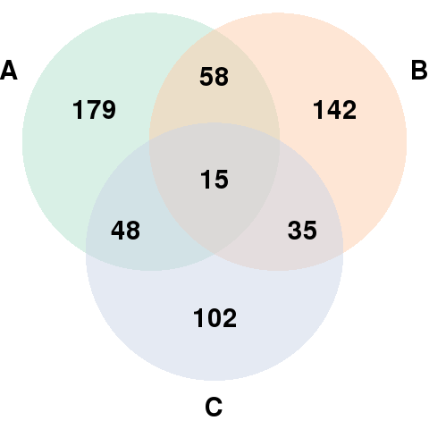
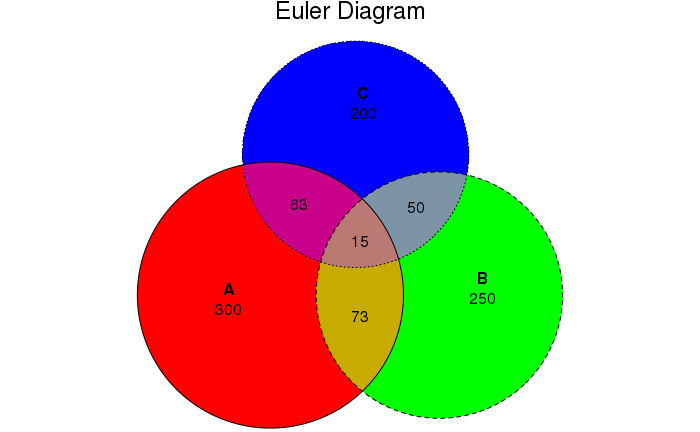

Euler diagrams are Venn diagrams without the requirement that all set interactions be present (whether they are empty or not). That is, depending on input, eulerr will sometimes produce Venn diagrams but sometimes not.  

Prominent R packages that produce euler and/or venn diagrams are: `eVenn`, `VennDiagram`, `venn`, `colorfulVennPlot`, and `venneuler`.


## Generate data 

```r
set.seed(1)
# Generate 3 sets of 200 words
set1 <- paste(rep("word_" , 300) , sample(c(1:1000) , 300 , replace=F) , sep="")
set2 <- paste(rep("word_" , 250) , sample(c(1:1000) , 250 , replace=F) , sep="")
set3 <- paste(rep("word_" , 200) , sample(c(1:1000) , 200 , replace=F) , sep="")
set4 <- paste(rep("word_" , 350) , sample(c(1:1000) , 350 , replace=F) , sep="")
```


## Generate venn diagram with `VennDiagram` package

### Three data sets (`draw.triple.venn`)

```r
suppressPackageStartupMessages(library(VennDiagram))
 
# # Prepare a palette of 4 colors with R colorbrewer:
library(RColorBrewer)
myCol <- brewer.pal(3, "Pastel2")

# Plotting
venn.diagram(
        x = list(set1, set2, set3),
        category.names = c("A", "B", "C"),
        filename = 'Venn_diagram_three.png',
        output=TRUE,

        # Output features
        imagetype = "png",
        height = 480,
        width = 480,
        resolution = 300,
        compression = "lzw",

        # Circles
        lwd = 2,
        lty = 'blank',
        fill = myCol,

        # Numbers
        cex = .6,
        fontface = "bold",
        fontfamily = "sans",

        # Set names
        cat.cex = 0.6,
        cat.fontface = "bold",
        cat.default.pos = "outer",
        cat.pos = c(-60, 60, 180),
        cat.dist = c(0.055, 0.055, 0.055),
        cat.fontfamily = "sans",
        rotation = 1
)
```




### Four data sets (`draw.quad.venn`)

```r
venn.diagram(
        x = list(set1, set2, set3, set4),
        category.names = c("A", "B", "C", "D"),
        filename = 'Venn_diagram_four.png',
        output=TRUE,

        # Circles
        lwd = 2,
        #lty = 'blank',
        fill = rainbow(4),

        # Numbers
        cex = .6,
        fontface = "bold",
        fontfamily = "Arial",

        # Set names
        cat.cex = 0.6,
        cat.fontface = "bold",
        cat.default.pos = "outer",
        cat.fontfamily = "Arial"
)
```


## Generate venn diagram with `eulerr` package

```r
suppressPackageStartupMessages(library(eulerr))

fit <- euler(c(A = length(set1), B = length(set2), C = length(set3), 
               "A&B" = length(intersect(set1, set2)), "A&C" = length(intersect(set1, set3)), "B&C" = length(intersect(set2, set3)),
                "A&B&C" = length(intersect(intersect(set1, set2), set3))))
plot(fit, 
     fills = list(fill = rainbow(3)),
     quantities = list(fontsize = 12), 
     edges = list(lty = 1:3),
     main = "Euler Diagram")
```


