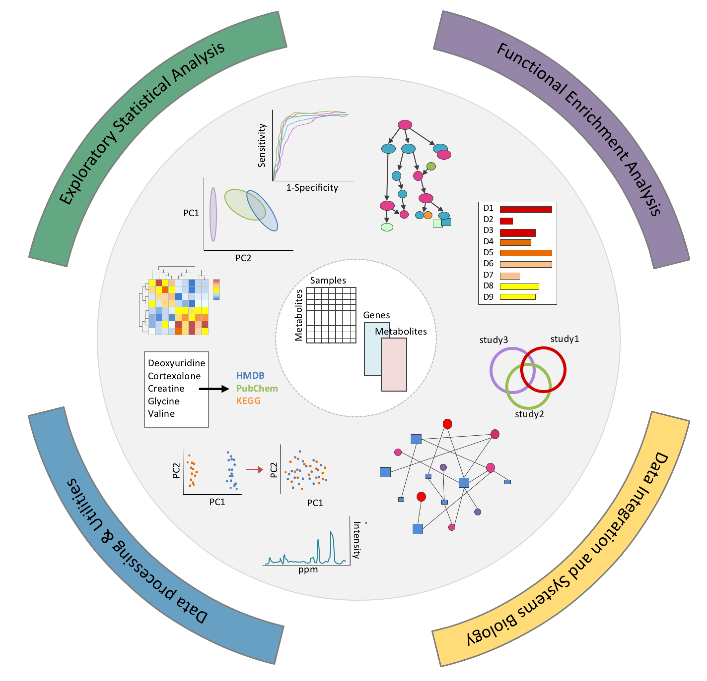
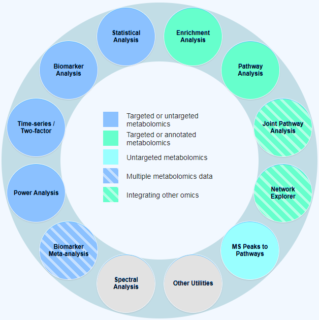
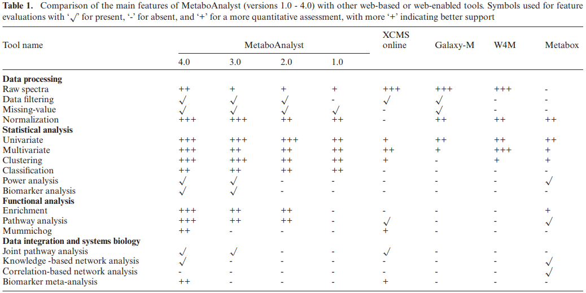

[`MetaboAnalyst`](https://www.metaboanalyst.ca/) 是一个在线的用于代谢组学数据分析、可视化和注释，并整合其他组学数据的综合性工具套件。从2009年的 MetaboAnalyst 1.0 采用单一模块实现了代谢组学数据处理和统计分析起，MetaboAnalyst不断更新，分别在2012年和2015年发布了2.0和3.0版本，以满足代谢组学研究不断发展的需要。而且为了更好地应对不断增长的用户需求，MetaboAnalyst 已经迁移到 [Google云服务器](https://cloud.google.com/)。2017年，至少四分之一的代谢组学研究都使用了MetaboAnalyst，说明其已经成为代谢组学数据分析的首选工具之一。2018年发布的4.0版本更新改善了用户界面、提高了可重复性/透明度，实现了支持批量处理、提供改进的来自非靶向质谱(MS)数据的通路注释、支持代谢组学生物标志物meta分析的新模块和多组学分析等功能，并扩展了代谢组和代谢通路数据库，且发布了R软件包 (MetaboAnalystR) 支持本地安装使用，在线分析添加了R 命令的历史面板以实现更透明及可重复的分析。   

## 1 MetaboAnalyst 4.0 框架概述

MetaboAnalyst 用户界面既提供了现代的“外观和感觉”，也有易于操作的模块化分析途径。所有功能被分为[4类12个模块](https://www.metaboanalyst.ca/faces/docs/Overview.xhtml)：

- **探索性统计分析**: 一般统计、生物标志物分析、双因素/时间序列分析和功效分析。可以接受来自靶向或非靶向的代谢组学数据集的数据。                               
- **功能分析**：代谢物组富集分析、靶向代谢通路分析和根据非靶向代谢组学MS数据预测通路活性 (基于mummichog算法)。                      
- **数据整合和系统生物学**：生物标志物meta分析、联合通路分析和network浏览器。      
- **数据处理和通用功能**：包含通用数据处理工具，如化合物ID转换，批处理效应校正，脂质组学，以及与三个基于网络的实用工具的关联，包含[支持NMR的Bayesil](), [支持GC-MS的GC-AutoFit]() 以及[支持LC-MS的XCMS Online](https://xcmsonline.scripps.edu/landing_page.php?pgcontent=mainPage)。       

 

## 2 MetaboAnalyst 知识库

MetaboAnalyst 中代谢物的信息主要是基于以下数据库：               

**化合物数据库**： 用于代谢物名称映射。功能分析之前，MetaboAnalyst执行内部映射，将常见化合物的名称映射到各种数据库标识符，包括 [KEGG](https://www.genome.jp/kegg/)、[HMDB](http://www.hmdb.ca/)、[ChEBI](https://www.ebi.ac.uk/chebi/)、[METLIN](https://metlin.scripps.edu/landing_page.php?pgcontent=mainPage) 和 [PubChem](https://pubchem.ncbi.nlm.nih.gov/)。             

**代谢物组和代谢通路库**：MetaboAnalyst的代谢物组主要由其MSEA模块使用。六个现有的和一个新的代谢产物组库，均是基于HMDB 4.0版本更新/创建。                

​            

## 3 MetaboAnalystR    

MetaboAnalyst 的多数分析都基于R软件的功能。现在使用该工具的时候会显示相应的R代码。不仅提高了操作的可重复性和透明性，也让用户可以在该代码的基础上进行修改，以实现更高级、更个性化、批量化的分析。 

安装使用[MetaboAnalyst 的R软件包](https://github.com/xia-lab/MetaboAnalystR)，可以保证用户能够实时“查看”并保存MetaboAnalyst正在运行的R代码，从而使得在本地使用该代码来再现分析工作成为可能。MetaboAnalystR和网络服务器两者之间可以完全互换，并在跨平台操作时也保证相同功能。在数据分析的每一步，R命令会显示在页面右侧“R命令历史”的侧栏中，每个命令会根据执行顺序出现。MetaboAnalyst还将整个R命令历史作为可执行R脚本存储，以便在完成每个模块后下载这个包含用户选择的所有参数和操作的脚本。这种形式（R脚本）可以很容易在网络上共享和复制，或者使用MetaboAnalystR包实现本地复制。

对于MetaboAnalyst的任何更新，都存在关于早期服务器执行的数据分析的可重复性的问题。例如，由于基础代谢物组库的更新，输入相同的数据，分析结果的排列顺序和P值将会改变。为了帮助解决这个问题，[MetaboAnalyst 3.0版](http://old.metaboanalyst.ca/MetaboAnalyst/) 仍可考虑维持使用，只要有足够访问和使用。     

## 4 MetaboAnalyst 模块

#### 1. Statistical Analysis    

这个模快主要是提供多种统计分析工具，包括一元的FC分析，t-检验，火山图，单因素的方差分析，相关分析；多元的PCA，PLS-DA和OPLS-DA；高维特征选取-微阵列的显著性分析（SAM）和贝叶斯分析（EBAM）；聚类分析-系统树图，热图，K-means 和自组织的神经网络分析（SOM）；以及基于随机森林和支持向量机的有监督的数据分类验证分析。

#### 2. Enrichment Analysis

这一模块主要基于若干个包含大约6300组代谢物组的文库能为人类和哺乳动物提供代谢组学的富集分析(MSEA)。用户可以上传: (1)一份仅含化合物的列表，或 (2)一份包含化合物浓度的列表。     

#### 3. Pathway Analysis

本部分模块能为21个模式物种提高通路分析（集成的富集分析，通路拓扑学分析和可视化），这21个模式物种主要包括Human，Mouse，Rat，Cow，Chicken，E.coli等，总共有大约1600个代谢通路。

#### 4. Biomarker Analysis

这个模块主要是基于ROC曲线对单个或多个潜在的生物标志物进行评估计算分析，主要是基于经典的一元的ROC分析和基于PLS-DA和SVM的多元ROC分析。这个模块还支持用户手动挑选生物标志物或挑选样本，从而灵活的进行评估与验证。

#### 5. Power Analysis               

这个模块的分析主要是基于前期的数据或相似的研究，计算和预估两个群体在某一置信度下，存在显著差异时的最小样本数，以改善代谢物研究计划。

#### 6. Integrated Pathway Analysis         

这个模块能提供代谢组学与转录组学的联合代谢通路富集分析及可视化说明。

#### 7. Network Explorer             

Network Explorer是对Integrated Pathway Analysis模块的补充，允许将代谢物和/或基因（包括KEGG直系图或KOs）映射到不同类型的分子相互作用网络上。它支持横跨传统通路的连接，并且能在全局视野下分析单个通路中不明显的功能变化。这种网络的可视化可以用于获得新的发现或帮助用户发现新的假设。网络浏览器模块目前支持五种类型生物网络，包括KEGG全局代谢网络、基因-代谢物相互作用网络、代谢物疾病相互作用网络、代谢物-代谢物相互作用网络和代谢物-基因-疾病相互作用网络。最后四个网络仅适用于人类研究。       

用户可以上传代谢产物列表和(或)基因列表。对于代谢物，目前接受化合物名称、HMDB ID或KEGG化合物ID作为代谢物标识符。对于基因，目前支持Entrez IDs, ENSEMBL IDs，官方基因符号或KEGG直系同源物。然后，使用MetaboAnalyst内部数据库来映射上传的代谢产物和基因列表。随后，用户可以选择五个网络中的任一个开始可视化地探索他们的数据，还可以执行功能富集分析，然后突出那些感兴趣的代谢物或基因涉及的功能网络。每个生成的网络可导出为SVG或PNG图片。交互式网络探索、功能富集分析和网络拓扑分析的集成将为用户提供更多的信息，促进相关研究。                     

#### 8. Time-series/Two-factor        

这个模块能为有明显时间特性的数据文件提供与时间和双因子有关的的数据分析，包括聚类分析和可视化（交互的3D-PCA分析和层次聚类的双因素热图）、普通双因素方差分析和多元的贝叶斯时间序列分析（MEBA）；也能提供方差同步主成分分析（ASCA）用以识别与各个试验因子有关的主要模型。

#### 9. Biomarker Meta-analysis  

为了解决生物标志物的验证和可重复性问题，该模块通过利用多个独立研究的汇总效能，显著地提高识别数据内的真实情况的精度，其目标是将来自多个独立代谢组学研究的数据集进行meta分析，以此识别更优的生物标志物。这种方法可以减少研究偏倚，从而使生物标志物更加可靠。

#### 10. MS Peaks to Pathways           

高通量分析和基于非靶向或MS的宏观代谢组学数据的功能解释仍然是当前代谢组学研究的主要瓶颈。传统的基于MS的处理通常包括峰值识别、光谱反卷积和峰值标注。解决这些问题的方法通常会产生一个“干净”的MS峰列表，然后通过搜索各种光谱或化合物数据库手动完成峰值标注。但这一过程通常会产生大量的假阳性，而高分辨率MS仪正不断地用来减少这些假阳性。在计算上，一种有前景的思路是将分析单元从单个化合物转移到单个通路（或任何一组功能相关的化合物，它们共同产生独特的光谱足迹）——类似于广泛使用的基因组富集分析或GSEA。Mummichog算法是这个思路的简洁、有效的实现方法，它使得利用高分辨率MS峰直接预测通路活性成为可能，而不需要预先执行精确的峰值标注。MS Peaks to Pathways模块支持基于Mummichog算法的MS峰值分析，从而与MetaboAnalyst的工作流程和前述的可重复性策略保持一致。该模块的知识库包括5个基因组规模的代谢模型以及21个生物体的扩展库。在未来几个月内，SMPDB通路还将包含其他模式生物。虽然在Mummichog算法中，化合物的识别通常不被重视，但是匹配化合物的后处理分析对于下游的验证和解释是至关重要的。为了满足这些需求，我们实现了KEGG式的全局代谢网络，允许用户可视化整个峰匹配模式，并交互放大为特定的候选化合物，以检查其所有匹配的同位素或加合物形式。

使用该模块，用户必须上传一张包含3列——m/z特征、P值以及统计数据（例如t值或倍数变化值）的表格。如果还没有计算出这些值，用户可以将m/z峰值列表文件或峰值表上传到MetaboAnalyst的统计分析模块进行统计分析，再将这些结果上传到“MS Peaks to Pathways”模块。同时，用户需要指定它们的精确度、离子模式（正或负）和P值界值，以描绘丰富的m/z特征和背景。在数据上传之后，用户必须选择一个有机体（库）来执行非靶向通路分析。

“MS Peaks to Pathways”模块的输出包括一个结果表，表内包含用户上传数据中所富集的通路排序。该表包括匹配总数、原始P值（Fisher精确或超几何测试）、EASE分数和根据用户数据使用Gamma分布建模的P值。用户可以点击“查看”链接查看每个通路的详细情况，也可以下载包含用户上传的所有m/z特征的化合物的匹配信息的综合表。重要的是，所有这些信息（通路、化合物和匹配峰）可以在KEGG全局代谢网络内直观地进行深入研究。该页面由三个部分组成：（i）含有控制各种可视化特征的菜单的顶部工具栏，（ii）显示通路分析结果的左侧面板和（iii）用于代谢网络交互式视觉探索的中心视图。用户可以滚动鼠标放大和缩小网络视图。点击通路左侧面板上的名称可以突出其所在网络的所有化合物。双击代谢物节点将显示相应化合物的所有匹配细节，当前视图有 PNG 或 SVG 文件下载。

#### 11. Spectral Analysis

用户提供易于使用、可免费用于光谱处理和注释的网络工具，包含支持NMR的Bayesil, 支持GC-MS的GC-AutoFit以及支持LC-MS的XCMS Online。     

#### 12. 其它功能：Other Utilities

这个模块包含若干常用公用功能，目前主要是：化合物ID转换，批处理效应校正和脂质组学数据分析。

其中化合物ID转换，将化合物与代谢组相关的大型数据库中化合物ID偶联起来，主要是基于最新版本的HMDB, SMPDB 和KEGG 等大型的数据库。

## MetaboAnalyst与其他工具的比较

MetaboAnalyst 与 [XCMS Online](https://xcmsonline.scripps.edu)、[Galaxy-M](https://github.com/Viant-Metabolomics/Galaxy-M)、[Workflow4Metabolomics (W4M)](http://workflow4metabolomics.org/) 和 [Metabox](http://kwanjeeraw.github.io/metabox/) 的比较。          

MetaboAnalyst为统计分析、功能解释以及与其他组学数据的整合提供了最全面的支持。它支持实时交互数据分析的方式，目前没有其他工具能够实现。虽然MetaboAnalyst在其原始频谱处理和注释的内置支持方面有所缺陷，但新的“频谱分析”特性有助于解决这一问题。原始LC-MS光谱处理和分析一直是XCMS Online、Galaxy-M和Workflow4Metabolomics的主要优势，而且这些工具仍然是LC-MS数据分析的必用工具。总体而言，MetaboAnalyst的主要优势在于其下游数据分析，就像Metabox一样。事实上，MetaBox的设计类似于MetaboAnalyst，它主要接受经过预处理的代谢组学数据，用于各种统计计算、功能分析和基于网络的整合。然而，Metabox当前必须本地安装后才能使用。          

## MetaboAnalyst 使用

数据的输入要按照网站的要求进行，[详细信息点击](https://www.metaboanalyst.ca/faces/docs/Format.xhtml)。                               

数据输出包括处理过的数据、图片和结果表格以及一份PDF报告。输出的图片默认是72dpi ，一般投稿需要是300~600dpi，可以在分析中，点击画板符号，选择需要的格式和分辨率保存图片；或点击表格按钮随时查看保存分析中的数据，点击R按钮，还能看到分析执行的R命令。         

