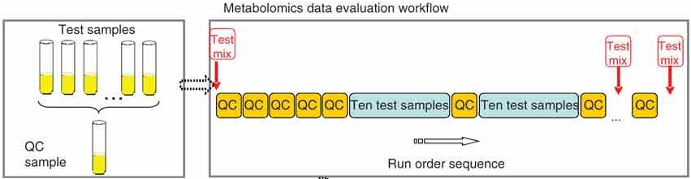

## Data measurement 

### Quality Control sample preparation        

[按照nature protocol的方法进行](https://www.nature.com/articles/nprot.2010.50)      

- 混合**相同体积**的所有待检测样本，然后按照与待测样本相同的前处理方法来处理QC样本，之后进样进行LC-MS分析。

- 样本检测时，通常在检测最开始运行几次QC样本，之后根据样本量的大小在每检测几个样本之后检测一次QC样本。    

   


### QC sample assessment      

- 方法一：最早使用的一种方法，从QC样本的总离子流图中选择具有代表性的离子峰（覆盖不同的保留时间，不同的强度），在对QC样本进行重复检测之后，计算这些离子的保留时间以及峰面积的**相对标准偏差（RSD）**，用以考察分析方法的稳定性以及重复性。               

- 方法二：所有样品检测完之后，收集所有的QC样本的原始数据进行数据预处理，包括（峰提取，排列，归一化等），经过数据过滤（80%规则）之后，计算剩下的峰的峰面积的RSD值。通常如果在**一个样本中有超过70%的化合物的RSD值小于等于30%**，则证明该方法有良好的稳定性以及重复性，所得到的数据可靠（也有不同的评价标准，比如要求**LC-MS数据小于20%**，**GC-MS数据小于30%**等）。         

  ```
  在我们的方法中，我们用的是，去除在QC样品中 RSD/CV > 30% 的代谢物。                   
  注意： Relative Standard Deviation (RSD) 
     == Coefficient of Variation (CV) 
     == Standard Deviation (SD) * 100 / Mean of the data
  ```

- 方法三：原始数据经过数据预处理之后，将**所有样本（包括QC样本）**进行PCA分析，在得分图中观察QC样本的聚集程度。由于QC样本是等量混合了所有的被检测样本，理论上QC样本包含了所有样本中的代谢物，因此**QC样本理论上会在原点紧密聚集**，证明方法稳定，重复性良好。

- 方法四：采用混合标准品作为QC，该QC通常包含**不同物理化学性质的体内和体外代谢物（使所选择的化合物具有代表性）**。检测结束后，计算这些化合物的**保留时间以及峰面积的RSD**用以对分离分析方法进行评价。


## Data Processing 

该代谢物数据分析流程从得到代谢物浓度矩阵后开始（一般矩阵行为样本，列为代谢物）。

### Data check 

检查数据完整性，检查数据格式是否正确，分类标签是否正确，代谢物名称是否正确。是否含有非数值型数据，是否含有缺失值以及恒为0的指标等。这对下一步的分析至关重要。       

### QC sample assessment 

数据的前处理要从QC样本的检测开始，通过对QC样本的检测来评价系统的稳定性，同时帮助研究者筛选数据。QC样本通常混合等量的所有样本来配制（非靶向代谢组学），或样本中添加已知的标准品来充当（靶向代谢组学）。详细见上面的四种方法。在这一步中，不能满足要求的变量将会从数据集中排除。

### Missing values 

在代谢组学研究中，由于技术以及样本的原因可能会包含大约20%的缺失值，大量的缺失值的存在以及不同的缺失值填充的方法已被证明会对接下来的统计分析产生影响。

常用的缺失值过滤填充方法有：                             

1. [“modified 80% rule”](https://pubs.acs.org/doi/abs/10.1021/ac051495j)：If a variable had a nonzero measurement value in at least 80% of the variables within one of the subsets, the variable was included in the data set; otherwise the variable was removed (也就是说当代谢物分别在所有组别中的缺失值都大于20%的时候，该代谢物才被去除)。   

   ```
   我们用的是这种方法
   ```

2. Replaces all the missing values with a small values (**the half of the minimum positive values in the original data**) assuming to be the detection limit. The assumption of this approach is that most missing values are caused by low abundance metabolites (i.e.below the detection limit).                    

3. Replace by mean/median/min of features. (虽然代码简单，但是也需要根据自己的数据评估效果)。

4. Impute missing value with k-nearest neighbour (KNN), probabilistic PCA (PPCA), Bayesian PCA (BPCA) method, Singular Value Decomposition (SVD) method。 [参考文献](https://www.ncbi.nlm.nih.gov/pubmed/17344241)                     

          

### Data filter    

在代谢组的数据集中，特别是非靶代谢组中，含有大量的变量，其中有一些的变量是由于基线噪音引起的，在数据建模和分析中不可用。一般来说，具有以下特征的代谢物需要过滤掉：                  

- 极小值 (临近基线或检出限的数值)                                                
- 恒定不变的值 (不随实验条件变化的值)                          
- 重复性不好的变量。               


### **Data Normalization**

在数据前处理中，还包括其他一些操作通过去除**系统噪音信号，去除由系统不稳定引起的干扰信号，消除操作的误差**等步骤来为下一步统计分析提供更加可靠的数据集。这些步骤主要包括 `normalization`，`scaling`，`centering` 等。每一步的操作都有不同的方法，同时也有不同的顺序组合。不同的数据前处理方法被证明对统计分析的结果有很大影响。数据标准化分为三类：                                

- Sample normalization：样本归一化能突显样本的特征性。                                         
- Data transformation：                                    
- Data scaling：       

数据转换和数据归一化，主要是将数据限定在一定的范围内，使得后续分析更加方便，程序运行收敛加快或服从某些特征函数分布，从而解析模型的特征。但是并不是任何问题都必须事先把原始数据进行规范化，也就是数据规范化这一步并不是必须要做的 ，要具体问题具体分析。          


## Statistical Analysis 

### 第一步: 非监督多元统计分析

通常使用PCA（主成分分析）。使用非监督分析有以下几个目的：


- 直观的观察被分析样本有无天然的分组

- 检查异常样本（在置信区间之外的点）

- 揭示研究中存在的隐藏的偏向性

- 展示样本分类的细节信息

- 这一步分析可以看作是一个数据质量控制的过程，如果样本点在score plot（得分图）中根据样本的分组展现出一定程度聚集，则证明数据的质量可信度。此外也可以在QC样本点被移除之前，通过观察QC样本点的空间分布来判断数据的质量，如果QC样本点紧密聚集则证明数据质量高。

- 在PCA分析之后，我们需要去除异常值（样本及变量），因此数据集的大小将会有所改变。通常来源于分析时程中，由于操作偏差引起的异常值需要从数据集中删除；但是，有些时候这些异常值可能并不是由于操作误差引起，可能代表了数据中一些新的发现，则这些数值需要保留用作进一步分析。

### 第二步: 单变量统计分析

  ，来筛选在不同组别中差异有统计学意义的变量。单变量统计分析在分析数据时，数据之间相互独立；多变量分析则考虑数据之间的相互作用和相关性，因此二者可以提供不同的关于数据的信息。

- 使用单变量分析为多元统计分析进行数据的预先筛选是一个有争议的操作，一些研究者不建议这种筛选方式，另一些则推荐使用此方法，将筛选之后的化合物进行后续有监督分析。

- 单变量分析多也被用在有监督分析之后，来检测通过有监督分析选择出的标记物在不同组别之间的差异有无统计学意义。（目前多数都是这么使用）

### 第三步: 有监督的多元统计分析
如PLS-DA（偏最小二乘判别分析），用以选择对样本分类贡献较大的变量即筛选标记物。这一步可以作为数据分析的最后一步，或者在这一步之后接着做单变量统计分析来检测所筛选的化合物的差异有无统计学意义。

- 需要注意的是，有监督模型建立之后需要进行模型的验证，如置换检验（permutation test，PLS-DA），交叉验证（cross-validation，OPLS-DA）等。

- 以上就是数据分析的一个常用流程，其中第二步通常有争议，目前多数都放在标记物通过有监督分析之后进行检查所选标记物的差异有无统计学意义。

- 关于标记物的筛选，还可以有很多其他的方法，参见上一篇公众号文章。

- 代谢物的鉴定和标记可以在数据分析结束之后进行，也可以在数据分析之前进行，在分析之前进行可以帮助我们选择唯一变量（即去除加合离子，碎片离子等）进行分析。